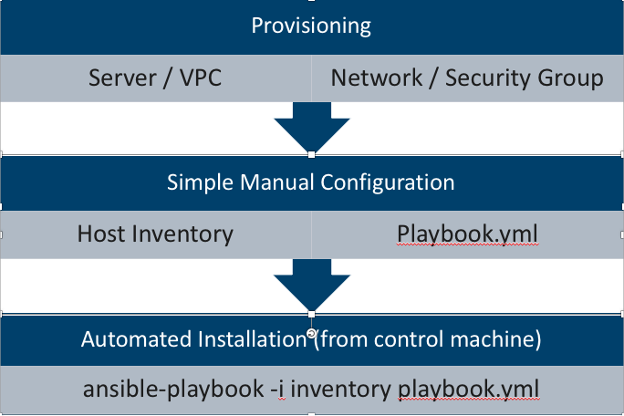

# Install Paxata using Ansible on Amazon EC2 Instances

Supported Versions:

Python2: 2.7+

Ansible: 2.4.3+

Jinja2: 2.7.2+

Pymongo: 3.1+

CentOS 7.5 or Redhat Linux 7.6

## Summary

This Ansible automated installation allows Paxata administrators to perform automated Paxata installation, configuration, upgrade or backup. The following shows how to perform installation on AWS EC2 Instances.

* What will be installed
   + Paxata Server 2018.2 latest release
   + Paxata Pipeline 2018.2 latest release
   + Apache Spark 2.4 (standalone cluster)
   + MongoDB 3.4.11
   + Common JDBC Drivers
   + Supported connectors in 2018.2 latest release

## WorkFlow

   Provisioning EC2 Instances / Configuring Network and Security Group -> Quick Manual Configuration of inventory and playbook -> Run Playbook

   

## Step 1 of 4 -- Install Ansible on Control Machine

* [Install latest Ansible](http://docs.ansible.com/ansible/latest/intro_installation.html#latest-releases-on-mac-osx) on the control machine, which can your local desktop or any remote host where you can ssh to the target hosts (provisioned as in step 2 below) with a private key.

   on CentOS/RHEL , run

   `sudo yum install https://dl.fedoraproject.org/pub/epel/epel-release-latest-7.noarch.rpm`

   `sudo yum update`

   `sudo yum -y install ansible`

   `sudo yum -y install python-pip`

   `sudo pip install --upgrade pip`

   `sudo pip install --upgrade Jinja2`


## Step 2 of 4 -- Provision Target Servers , specs as documented in https://docs.google.com/spreadsheets/d/1IOECESjo9wCl7d9DRBv7EU6o0GZoo6jkJmnh4SBPies/edit?ts=5c531359#gid=0

* S3 Bucket for Paxata Data Library and MongoDB Backup
  
  + IAM Role with following permissions on all above servers. 
  OR
  + AWS credentials (access key and secret key)

  S3 Permissions

  "Action": [
  
                "s3:ListBucket",

                "s3:PutObject",

                "s3:GetObject",

                "s3:DeleteObject",

                "s3:GetObjectAcl"
            ],

* (Optional) Dynamic Batch Cluster running EMR 5.16
  
  + server9 (EMR Master): paxata-gateway
  + autoscalable EMR Task Nodes (minimum 1)

Here's the reference link on how to attach instance store to instance: https://objectivefs.com/howto/how-to-add-instance-store-to-aws-ec2-instance

Here's the reference link on how to attach EBS to instance: 
https://docs.aws.amazon.com/AWSEC2/latest/UserGuide/ebs-attaching-volume.html

* Configure AWS Instance Security Group
  
  All Servers should belong to one security group

  Security Group Inbound Rules

|  **Type** | **Protocol** | **Port Range** | **Source** | **Description** |
|  :------ | :------ | :------ | :------ | :------ |
|  SSH | TCP | 22 | Administrator IP | SSH Access for Admin |
|  Custom TCP Rule | TCP | 4040 | End User IP | Spark Jobs UI |
|  Custom TCP Rule | TCP | 8080 | End User IP | Paxata HTTP |
|  Custom TCP Rule | TCP | 8443 | End User IP | Paxata HTTPS |
|  Custom TCP Rule | TCP | 5445 | This Security Group | Internal HornetQ |
|  Custom TCP Rule | TCP | 8090 | This Security Group | Pipeline Server |
|  Custom TCP Rule | TCP | 8071 | This Security Group | Gateway Server |
|  Custom TCP Rule | TCP | 9080 | This Security Group | Data server |
|  Custom TCP Rule | TCP | 7077 | This Security Group | Spark Master |
|  Custom TCP Rule | TCP | 7078 | This Security Group | Spark Worker |
|  Custom TCP Rule | TCP | 18080 | Administrator IP | Spark Master UI |
|  Custom TCP Rule | TCP | 18081 | Administrator IP | Spark Worker UI |
|  Custom TCP Rule | TCP | 30000 - 65535 | This Security Group | Pipeline Worker File Server |
|  Custom TCP Rule | TCP | 27017 - 27019 | This Security Group | MongoDB Cluster |


* Test SSH connection to the target / remote hosts, from the control machine

   For example, on AWS control host to ssh to remote host (worker1) using private key, run 

   `ssh -i myprivatekey.pem ec2-user@worker1`

#
## Step 3 of 4 -- Configure host inventory file and customization.yml

* There are two sample inventories for aws and azure
 
   + **~/inventory.aws** ec2 instances for apache standalone spark only and no separate dynamic batch gateway (Test or Production)

   + **~/inventory.azure** azure instances for apache standalone spark only and no separate dynamic batch gateway (Test or Production)


* Change the following variable values in host inventory (`~/inventory.aws`):

  + **mongo1/mongo2/mongo3/core/data/auto/pm/worker1/worker2/worker3** are psudo hostnames to be used in /etc/hosts for inter-server communication. You can leave them as is, except when you use gateway server for dynamic batch, then you have to change them to actual IP addresses of the target servers, because the dynamic EMR workers won't have the /etc/hosts entries.
  
  + **ansible_host** public or private IP addresses of the target servers used when SSH from the control machine

  + **private_ip** private IP addresses to be used in /etc/hosts file for inter-server communication
  
  + **ansible_ssh_user** and **ansible_ssh_private_key_file** to ssh user and private key to access all target/remote hosts

* In customization.yml,  update the values to your choice, for offline based install contact support.

* Test flash server download in target hosts, from the control machine

  `export ANSIBLE_HOST_KEY_CHECKING=false`

  `ansible-playbook -i inventory.aws.ec2 playbook.yml --tags=test_connection`

## Step 4 of 4: Run playbook to install Paxata

1. Skip hostname check on your control machine:
`export ANSIBLE_HOST_KEY_CHECKING=false`

1. Make sure your are still in quick-automated-installation directory:
`ansible-playbook -i inventory.aws.x playbook.yml`

For Upgrade use the upgrade flag
  `ansible-playbook -i inventory.aws.x playbook.yml --extra-vars "upgrade_flag=true"`

1. Optionally when prompted, enter your username and password to access https://flash.paxata.com/GA (if you don't have credentials to access https://flash.paxata.com/GA, please email servicedesk@paxata.com to request one)

1. When the playbook is run completed without error, go to Paxata UI using **public IP address or hostname** 

> https://core:8443

If you can see the Paxata UI, congratulations! You have installed Paxata!

## Questions?

Q: Can I pick whatever paxata version to install?

A: Sorry there's no way to pick the version, as the playbook only works with latest 2018.2 version on https://flash.paxata.com/GA/2018.2/

Q: What is the login available?

A: These are the default logins for any new paxata installation:

```
admin/admin
superuser/superuser
prodadmin/prodadmin
```
Q: Is there a limit on file size / row / column ?

A: Yes. These limits are calculated based on the total worker cores in your spark cluster (spark_worker_cores * number of hosts in spark-worker group in inventory). Formula is defined in playbook.yml. You can also change the guardrail in Admin -> Global default guardrail in the Paxata UI as "superuser"

Q: In Vagrant Local VM deloyment, if I want to destroy the VMs and reinstall Paxata afresh, What should I do?

A: It's easy. Just three commands:

`$ vagrant destroy`

`$ vagrant up`

Navigate to your quick-automated-installation directory

Rerun the playbook

`$ ansible-playbook -i inventory.aws.x playbook.yml`

For Upgrade use the upgrade flag
 `ansible-playbook -i inventory.aws.x playbook.yml --extra-vars "upgrade_flag=true"`

For any other questions, please email `servicedesk@paxata.com`

Q: Why did the task "boostrap: Download Paxata Server Versin File" fail with "HTTP Error 401: basic auth failed"?

A: That means your flash server credential is invalid. Please rerun the playbook and enter the valid credential when prompted.

Q: When using local vagrant VMs, how do I start/stop/destroy the VMs?

A: * Common Vagrant commands
  + If you want to stop the VMs. Data will not be lost.
    `vagrant halt`

  + If you want to destroy the VMs. Data will be lost.
    `vagrant destroy`

  + After destroying the VM, you can easily recreate the VMs.
    `vagrant up`

A: If your target hosts do not have Internet access, follow these steps:

```
On core server, install httpd
  sudo yum -y install httpd

Edit /etc/httpd/conf/httpd.conf 
  change "Listen 80" to "Listen 8414"

Create a subdirectory for httpd
  mkdir /var/www/html/pax


From any host with Internet access, download Paxata bundle.zip and upload it to core server
  wget --user xxxx --ask-password --no-check-certificate https://flash.paxata.com/GA/2018.2/ansible/bundle.tgz


Unzip the bundle to /var/www/html/pax and set correct permission
  tar -zvxf bundle.tgz -C /var/www/html/pax/
  chmod -R ugo+rX /var/www/html/pax/

Start httpd server
  service httpd restart

In browser: navigate to http://core:8414/pax/efs/flash/GA/2018.2/ to ensure all files are accessible

Install Open JDK and bind-utils on all target servers:
  sudo yum install -y java-1.8.0-openjdk-devel
  sudo yum install -y bind-utils

Update playbook.yml, comment out the ###Remote Repository URL### section and uncomment the ###Local Repository URL### section

Run the playbook
  ansible-playbook -i inventory.aws.x playbook.yml

For Upgrade use the upgrade flag
  ansible-playbook -i inventory.aws.x playbook.yml --extra-vars "upgrade_flag=true"

```
